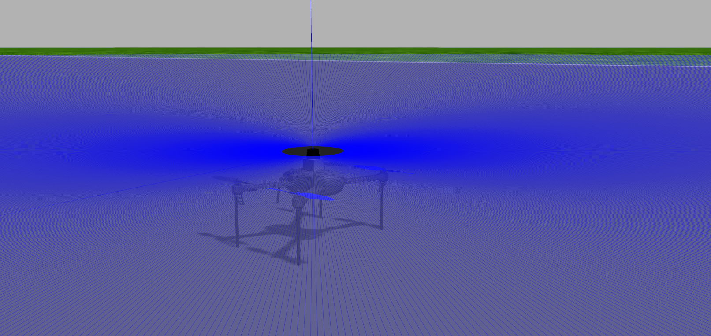

# Simulations

This repo hosts gazebo worlds for various drone scenarios and various drone configurations. This Repo is specifically designed to work with the Ardupilot control system, and utilizes the ardupilot gazebo plugin to allow the ardupilot control software to interface and control the model drone in gazebo. 

## Vehicles Supported 

- [Quadcopters](#drone-simulations)


## Dependencies 


[Installing Ardupilot and MAVProxy](https://github.com/ArduPilot/ardupilot.git)


[Installing Gazebo and ArduPilot Plugin](https://github.com/khancyr/ardupilot_gazebo.git)

Installing x-term is recommended as it allows the ardupilot sitl interface to run in a terminal that will cleanly close when closing you sitl instance
```
sudo apt install xterm
```

## Drone Simulations 


This repo contains a couple different gazebo worlds containing various ardupilot drone configurations. The worlds are listed below

- `droneOnly.world` - simple gazebo world containing only a single drone
- `runway.world` - simple gazebo world containing only a single drone on a runway
- `lidar.world` - a simple gazebo world containing a single drone with a 2d lidar sensor 

### Running Drone Simulations 

Each world contains a corresponding launch file. For example to launch `runway.world` run
```
roslaunch sims runway.launch
``` 
Launch the ardupilot instance by running 
```
cd ~/ardupilot/ArduCopter/ && sim_vehicle.py -v ArduCopter -f gazebo-iris --console
``` 


## Models


### drone_with_lidar

Example drone that has a 2d lidar attached. The lidar plugin publishes a `sensor_msgs/LaserScan` ROS msg containing return data.

topics
```
/spur/laser/scan
```



### drone_with_sonar

Example drone with 4 sonars attached in each direction. Each sonar publishes a `sensor_msgs/Range` ROS msg containing range data.

topics 
```
/drone1/sensor/sonar/back
/drone1/sensor/sonar/front
/drone1/sensor/sonar/left
/drone1/sensor/sonar/right
```

### drone_with_camera 

Example drone with a forward facing camera. The camera published a `sensor_msgs/Image` ROS msg which can be used to view or do image processing on. 

